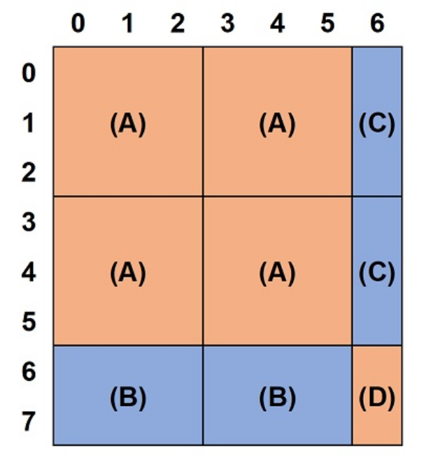

# Notes of ABC

记录些值得学习的题目

## ABC 353

### C - Sigma Problem

枚举一个数列的所有不重复数对（组合），每一对求和后对MOD = $10^8$求余，求这些值的和。**已知每个数都小于MOD**

#### 思路

暴力要N^2，太慢了

可以反过来求：求总sum（取出所有数对的总和：每个数都会被取出n - 1 次，所以等于（n - 1) * 累计和），再找出其与答案的差，通过检查：每一个数对和是否>=MOD？若是，则最终答案要减去一个MOD（因为他在答案里被mod掉了一次）

具体思路：先排序O(nlogn)，再双指针从两端收缩O(n)

- 如果left + right >= MOD， 则 [left, right) 内的所有值，与right的和都会超过1e8各1次，所以累计次数+= (right - left)，然后right不再检查，right --
- 否则，left与 (left, right] 内的所有值都不会超过MOD，计数不变，left不再检查
- 可证：每次循环开始时，lef和right之外的数都已经计算完毕，只需关注内部的数量即可

最后相减即可。注意accumulate返回的是初始值的类型，要提前设置ull

### D - Another Sigma Problem

数论太菜弃了

## ABC 341

### D - Only one of two

数论

You are given three positive integers **N**, **M**, and **K**. Here, **N** and **M** are different.
Print the **K**-th smallest positive integer divisible by **exactly one** of **N** and **M**.

#### 思路

首先，一个数能同时被m和n整除，一定是m和n的公倍数。另外，对于任意一个数$X$, 有$\lfloor X/D \rfloor $个不大于$X$的数能被$D$整除

那么，对于M和N, 能够刚好被其中之一整除的数，等于能被两个数整除的数各自相加，再去掉能被公倍数整除的数，由于属于公倍数的计数在两次计算里都被算入，所以要减去两次：

$$
\lfloor X / M \rfloor + \lfloor X / N \rfloor - 2 * \lfloor X / lcm(M, N) \rfloor
$$

题意便转换为查找X，显然这个函数随X增大单调递增，二分即可

## ABC 355

### D - Intersecting Intervals

给定一组区间，占据的段落为[l, r]，求相交的区间的对数，头尾相接也算相交。

#### 思路

**思维定式：遇到区间就以为是贪心**，还可能是线段->几何相关。

**关键字：intersection，应当想到是《挑战》16.13：二维线段求交的简化版**

- 将区间端点按位置排序，其中如果位置相同，l排在r前面。
- ans初始化为0
- 创建一个虚拟的竖直线段，从左向右扫描
- 维护一个“与当前竖线相交的线段数：Counting”，执行以下过程：
  - 如果是左端点:
    - 说明我们遇到了一个新的线段，与现在我们竖线扫描到的所有线段都相交，ans += Counting
    - 随后，该线段计入扫描中的线段数内，Counting++
  - 如果是右端点:
    - 我们离开了一个线段，Counting--

## ABC 337

### D - Cheating Gomoku Narabe

一个H*W的grid，由x, o, . 组成，x无法更改，求得到一条长度为K的竖直/水平的'o'直线最少需要更改几个'.'?

#### Input:

```
3 4 3
xo.x
..o.
xx.o
```

#### 思路

**本题专治思维定式：看到grid，就开始dp/图/回溯之类, 小题大做. grid也由多个一维数组组成**，如果各直线方向的子问题的答案互相独立，应当先拆分成几个低维数组，尝试更简单的解法。

**构造直线？**

- 每组子问题只与竖直、水平方向有关->可以竖直、水平拆分成独立的行/列求解
- 直线是连续的内容->滑动窗口 / 前缀和解决

**滑动窗口的设计：**

- 滑动窗口需要注意维护的内容，必须要为问题的硬性条件服务（如窗口长度、计数的条件），需要尝试不同维护，找到方便处理的一种
- 如果维护一个check['x'] == 0的窗口，那么这个窗口的左端点收缩的长度无法确定，而题目要求必须为K，则无法准确匹配到每一个长度为K的直线
- 如果选择维护一个长度为K的窗口，则只需要每次收缩后检查check['x']即可。可看出此方法较优

## ABC 336

### D - Pyramid

我们称：形如1, 2, 3, 4...k - 1, k, k - 1...4, 3, 2, 1的对称序列为pyramid sequence，给一个sequence，你可以无限重复以下操作：

- 将任意一个数减小
- 从某一端删去一个数

求这个sequence能得到的最长的pyramid sequence

#### 思路

当时的思路：pyramid对称->有点类似回文串？dp？->直接dp太难，放弃->考虑中心点和左右的数值有关->从两侧算一次端点的最大最小？->但区间的最大最小没法N^2内求出，放弃->单调队列？->偏题

由于只能从两端删除，实际上就是问能不能构造出一个最长的pyramid子数组

- **想到dp，绝对不要认为直接dp很难就放弃**，要会拆分、分析子问题。
- **一个看起来比较复杂的问题，注定能进行分解，因此要暂时抛掉原问题，在子问题中进行思考。**

 对一个pyramid序列，我们可以拆分开来处理：pyramid的左半是一个递增的子数组，对称地，右半是一个递减的子数组。

由于我们只能减小其中的值，那么以这个点为中心的最大的pyramid长度取决于下面两个属性的**最小值**：

- 左半侧能构造多长的递增子数组
- 右半则能构造多长的递减子数组

因此，对于这两个问题，分别构建两个dp，一个从左向右，一个从右向左，计算以A[i]为端点的递增/递减序列的最长长度即可。

## ABC 334

### C - Socks 2

原来有N双袜子，颜色分别为1 ~ N，丢了|K|只互不相同的颜色的袜子，要把剩下的袜子两两组成一对，使得组合后每对袜子的颜色差（i - j）的总和最小，剩余奇数双袜子时需要丢掉一只袜子。求这个最小值。

#### 思路

- 首先，题目很有贪心的味道，两两配对，那么按贪心思路应该直觉想到：如果一个颜色p没丢，那么和它原来的袜子配对一定可以产生最优解。这是因为三角不等式:

$$
|i - p| + |j - p| \ge |i - j| + |p - p|
$$

    使得我们每次将(i, p)和(j, p)进行重组都是安全的。

- 既然未丢的袜子都和其原来的袜子配对，那么wiredness就可以通过所有被丢掉的袜子进行配对后得出。贪心可证，我们每次只要选出两个最大的袜子进行配对就可以构建最优解
- **但这是在K为偶数的情况。本题重点在于：如果K是奇数，我们需要丢弃一个袜子使剩下的袜子达到最优解**
- 有一个隐藏的推论：在排序后选出我们需要丢掉的袜子，一定可以使得被分开的两个子数组都是偶数个（因为如果两边是奇数，那么我们一定可以选择丢弃旁边的一个，得到一个更优的解）
- 那么什么东西可以得到一个数组前段的累计属性？**前缀和！相对称地，后半段可以通过后缀和算出**
- 定义前缀后缀，K下标从0开始
  - presum[i]: 前i个数，即K [0, i)进行两两配对，得到的前缀wiredness总和, i必须为偶数。
  - sufsum[i]: 后K - i个数，即K[i , K) 进行两两配对，得到的后缀和，K -  i 必须为偶数(即i为奇数) 。**注意这里有一点保证了sufsum和presum在同一i下是对应的，即当i为偶数时, sufsum[i] = sufsum[i+1]，也就是此时sufsum[i]表示的是(i, K)这一区间。**
  - 我们想知道丢掉K[i]后，所得到的wiredness，直接通过遍历每个偶数i，计算presum[i] + sufsum[i]即可得出。

### D - Reindeer and Sleigh

圣诞老人有$N$个雪橇，每个雪橇需要$R_i$头驯鹿，给$Q$组驯鹿，求每组分别最多能拉多少车？每头驯鹿最多拉一辆车。

**前缀和模板题。** 看起来是dp，但因为每个雪橇只能选一次且没有区别（价值都是1），每个驯鹿只能拉一次，所以贪心，每次选需要最小的车即可。

那么，直接对R进行排序，然后算出前缀和，对每个query进行二分查找右边界(再- 1)，即可知道每组query最多能拉多少车

再次强调presum定义：

- pre[i]为（排序后的）**前 $ i$ 辆**车所需要的驯鹿总数。因此pre大小为$N + 1$，$pre[0] = 0$, 这样定义比较方便计算。

## ABC 332

### D - Swapping Puzzle

给定两个grid A, B, 你每次可以对A进行以下操作之一：

- 交换相邻的两行(i, i + 1)
- 交换相邻的两列(j, j + 1)

求最少需要多少次操作，可以使A = B？如果无解，输出-1

#### 思路

因为格子很小，其实不难，bfs即可。

但并不了解如何利用python特性储存每个格子作为访问节点进行bfs，所以卡了。实际上很简单。

- 主要用到两个特性：
  - 标准库的copy.deepcopy()：深拷贝, 需要对嵌套数组进行bfs/dfs时需要用到
  - python可以将tuple视为hashable（前提是tuple的内容也为hashable），因此可以将grid转换为二维tuple，然后用作dict的键
- 因此，将所有情况视为图的节点，对每个grid进行bfs即可，通过节点访问dict时要转一次tuple

## ABC 356

### C - Keys

你有1~N，共N把钥匙，其中有只有几把是真的，有一扇门，你测试了M组钥匙，每组用了Ci把互不相同的钥匙，只有当你至少用了K把真钥匙的时候，门才会开，结果为'o'，否则为'x'。求2^N种真钥匙的组合中，一共有几种组合能满足你的这些测试结果

#### 思路

**状态压缩基础题**

N把钥匙，压缩成一个N-bit的整数，每位上为1时表示令该钥匙为真。

对于每种真钥匙组合Ci，它意味着：我们可以从这组真钥匙中**任选**>=K把，都能够打开这扇门。

那么，将每个组合Ci与测试Ti进行比较，有两种情况：

- 如果测试结果成功，意味着这组测试T中的所有的">=K把钥匙的组合"中，应该**至少有一组**是我们所选Ci的子集
- 如果失败，则意味着这组测试中的所有">=K把钥匙的组合"，**都不能**是我们所选Ci的子集，否则与我们所定义的有效冲突。

所以，用状态压缩储存测试的组合，遍历每种组合，然后对于每种组合C，进行以下操作：

- 遍历所有测试Ti, 求出组合C与测试组合Ti的子集
- 用bit_count()得出位数，即C与Ti的子集里有多少把真钥匙
  - 如果结果为'o'且子集数<K，则意味着：在当前C中我们不能找出一组成功的组合，使他也在Ti中，则该组合冲突
  - 如果结果为'x'且子集数>=K，则意味着：在当前C中我们至少有一组组合，它在C中能打开门，但Ti中却不能打开，冲突。
- 如果C不与所有的Ti不冲突，则视为可行的一组

### D - Masked Popcount

Given integers **N** and **M**, compute the sum $\sum _{k = 0}^{N} popcount(k \& M) $, modulo 998244353.

* **N** is an integer between $0$ and $2 ^{60} - 1$, inclusive.
* **M** is an integer between $0$ and $2 ^{60} - 1$, inclusive.

#### 思路

遇到二进制相关，一定要尝试几个小的例子，增加对二进制的直觉。

题意转换：0~N之间的所有数K，所有位置上，M与K同为1的数量

 交换求和次序-> 在所有位置i上，对于所有0~N之间的数，在i上其与M同为1的数的数量

- 如果M在i位是0，那么不需要计数，为0
- 如果M在i位是1，那么，我们的任务就变成了：**0~N之间，有多少个数在第i位上是1**

观察一个较小的数据：假设我们最多有3位

| k\i | 2 | 1 | 0 |
| :-: | - | - | - |
|  0  | 0 | 0 | 0 |
|  1  | 0 | 0 | 1 |
|  2  | 0 | 1 | 0 |
|  3  | 0 | 1 | 1 |
|  4  | 1 | 0 | 0 |
|  5  | 1 | 0 | 1 |
|  6  | 1 | 1 | 0 |
|  7  | 1 | 1 | 1 |

可以看到，在i = 0位上，从上到下有一个重复的pattern'01'，在i = 1上，有'0011'，以此类推。

那么，在任意 $ i$ 位上，我们只要算出0~N这些数中，有几个长度为$2^{i+1}$的完整的pattern即可，每个pattern由等数量的0和1组成，因此每组对答案的贡献是pattern长的一半，即$2^i$, 另外还要再加上剩余的不到一组pattern中有多少个1（如果剩余的长度不大于pattern长的一半，则剩余的pattern没有贡献）

## ABC 331

### D - Tile Pattern

一个$10^9 * 10^9$的grid，由若干个小很多的重复的$N*N$grid组成，每个格子有黑白两种颜色，给若干个由A,B,C,D组成的query，求以(A,B)为左上，(C, D) 为右下的矩形面积 (下标从0开始)

#### 思路

再次强调务必先试试规模较小的数据, 找找规律

和一维前缀和一样, 再次强调二维前缀和的定义：**前H行, 前W列** 所围成的矩形的面积，因此precal为 **(N+1) \* (N+1)** 大小的二维数组.

二维前缀和的构建和查询不再赘述, 不熟练的话可以画个例子试一下

为了防止混乱, 任何关于查询/更改的函数, 都应该在外部提前转换为前缀的index (即+1), 在函数内部按前缀定义处理. 并且, 计算面积方面,明显应该传入的h*w从1开始更方便, 否则在计算重复个数的时候会产生混淆

假设有一个3*3的重复grid, 我们求(7, 6)的前缀面积, 那么可以进行如下操作:

- 首先, 如果该面积足够大, 那么他可以从左上角开始, 填充若干个完整的grid (A), 直到放不下为止
- 接下来, 还剩下一个L型区域, 我们可以将其分为长度为3的倍数的竖条状 (C) 和宽度为3的倍数的横条状 (B), 再加上一个小于3 * 3的区域 (D), 共计三部分
- 其中我们可以横向/竖向填充多少grid的数量决定了B和C各有多少, 而剩下的不完整的grid就是我们余下的长和宽, 这些面积都可以直接通过前缀数组算出, 再乘以他们的数量, 再相加即可



## ABC - 330

### C - Minimize Abs 2

给一个正整数D, 求 $|{x^2 + y^2 - D}|$ 的最小值, 其中x, y >=0

#### 思路

首先, 遇到搜索题, 不一定都要通过二分求解. 对于穷举双变量的题, 最常见的穷举做法是: 在遍历的过程中, 固定一个值, 通过设其为已知值快速找到另一个的最小值. 这里假设固定x, **但我们需要找到x的遍历范围. 这里可以证明**

$$
x \leq \lceil \sqrt{D} \rceil
$$

这是因为当$x > \lceil \sqrt{D} \rceil$时, $|{x^2 + y^2 - D}|$ 的最小值的情况都为y=0, 但x=$\lceil \sqrt{D} \rceil$, y = 0的值都比前者取到的的最小值更大.

接下来, 穷举每个x, 设$C = x^2 - D$, 那么问题就变成了求$|y^2 + C|$的最小值, 设

$$
f(y) = |y^2 + C|
$$

于是:

- 当 C >= 0时, 该函数为二次曲线, 在y = 0处取最小
- 当 C < 0时, 该函数为一个非负偶函数, 当 $y = \pm \sqrt{C} $时取最小, 但y只能为非负整数, 我们取离$ \sqrt{C} $最近的两个整数$\lceil \sqrt{C} \rceil, \lfloor \sqrt{C} \rfloor $代入进行比较即可

总结: 要点在于双变量的穷举法时找到其中一个的取值范围, 应该通过多做同类型的题学习

### E - Mex and Update

给n个数A1...An和q组查询(ik, xk), 每组替换A[ik]为xk, 每次更新后输出A的mex.

mex: 一个最小的, 不包含于A内的正整数

#### 思路

本题两个难点:

- 鸽巢原理: A只有n个数, 因此对于[0, n]而言, 一定有一个数是空出来的, **所以mex一定在[0, n] 这一范围内, 因此我们确实可以通过存储所有的可能的mex值来完成.** 做题时想到了这一思路, 但遗憾的是没想起来鸽巢引理, 认为储存的数据太大便放弃了.
- 一个维护mex的数据结构. 我们需要这样一个数据结构来维护可能的mex: 他是排序的, 且可以快速地(至少, O(logn)级别地) 对元素集合的任意数据进行修改

因此, std::set,或线段树可以满足这样的需求. 太久没用过忘了.

python有一个第三方库sortedcontainers可以使用SortedSet

另外, 我们还需要一个维护A内元素的counter来管理mex集合, 由于mex只可能取在[0, n]以内, 所以我们可以忽略掉所有大数的查询更改

## ABC 329

### E - Stamp

给一个N长串S, 一个M长串T, 给你一个N长的纯'#'串, 可以进行如下操作:

- 选择一个M长的子串, 将他替换为T

问能否从'#'串通过重复该操作得到S?

- M <= 5

#### 思路

完全想不到能bfs

- 尝试逆向还原成通配符串, 易证明如果逆操作可行, 那正序依然可以从'#'得到S
- 我们把在 {包括S以及构建出S的所有过程串} 中, 与T匹配的子串的起点位置(u)视为一个节点. 如果答案可行, 我们最后一步一定是将一个子串替换为了T, 那么S串本身一定至少有一个 '源' 节点.
- 我们找到节点 i 后, 将他还原, 这会将i + m个字符还原成通配符, 而这个操作对 S[i - m + 1, i + m - 1] 内的所有点都可能造成影响, 这是因为在正向构建S时, 字符会互相覆盖, 而中间互相覆盖的过程并不重要, 所以在逆向复原的过程中就可以将之前被复原过的位置视为一个通配符.
- 那么, 从一个已知的节点u出发, 我们视u和所有"将S[u, u+m) 还原后出现的新节点"之间都有一条边, 进行遍历即可
- 最后, 我们查看是否能够访问到所有的节点来得出答案
- 注意控制节点的取值范围

因为M很小, 暴力搜索即可

总结: 在想到逆向还原后, 应该简单模拟以下还原过程, 也许就能想到后面的步骤, 对图类题目要敏感

## ABC 328

### E - Modulo MST

一个图，找到他的modulo mst，对modulo mst的定义是所有生成树中总权重 MOD k后最小的那个

#### 思路

mod后不再满足最优子结构, 枚举。

如果是这种NPhard的图问题，就用不着bfs/dfs了, 直接枚举所有子集, 找到最小的modulo生成树, 结束.

python有一个itertools.combinations可以生成任意集合的所有子集, 很方便.

建议使用pypy作为解释器，CPython太慢了

总结: np问题不必要进行常规的遍历, 直接对边集进行枚举即可. 可以复习下回溯的模板

## ABC 327

### E - Maximize Rating

Takahashi打了N场比赛，每场比赛Pi分，他的总评分R计算方法如下：

先在N中**按顺序任选**出k个分数: (Q1, Q2, ..., Qk), 然后计算:

$$
R=\frac{\sum_{i=1}^k (0.9)^{k-i}Q_i}{\sum_{i=1}^k (0.9)^{k-i}}-\frac{1200}{\sqrt{k}}
$$

即他的总评分. 求这个分最大可以到多少

- N <= 5000

#### 思路

  看起来很吓人, 但有点纸老虎的感觉, 总之呢, 就是dp

  对于每一个固定的k, 我们可知道该式的大小只与Q的选取有关, 或者说, 只有

$$
\sum_{i=1}^k (0.9)^{k-i}Q_i
$$

  这个东西会变. 所以我们只关心在不同k的情况下, 最高分别能得到多少分, 然后选一个最高的即可

- 设dp[i][j]为: 如果从前i个数中选出j个数, 最大能得多少分?
- 状态转移

  - 边缘条件:

    - 初始: 当j = 0时, 我们没得选, 0分
    - 因为每个dp[i]最多能选i个数, 所以 j <= i
    - 当 j = i 时, 我们只有一个选择, 那就是把他们都选了
  - 考虑选取了一组数, 设 :

    $$
    X_k = \sum_{i=1}^k (0.9)^{k-i}Q_i
    $$

    我们向这组Q加入了一个新的$Q_{k + 1}$, 则:

    $$
    X_{k + 1} = \sum_{i=1}^{k + 1} (0.9)^{k + 1 - i}Q_i
    $$

    总之呢, 就是先这样, 再那样, 把$Q_{k + 1}$拿出来, 前面提一个0.9

    $$
    X_{k + 1}= 0.9\sum_{i=1}^{k} (0.9)^{k - i}Q_i + (0.9)^{k + 1 - k + 1}Q_{k + 1} = 0.9 X_{k} + Q_{k + 1}
    $$
  - 和背包差不多,但每个分数重量相等. 转移函数:

    $$
    dp[i][j]=
    \begin{cases}
    0 & (if j = 0) \\
    \max(dp[i-1][1],P_i) & (\text{if }j=1) \\
    \max(dp[i-1][j],0.9\times dp[i-1][j-1]+P_i) & (\text{if }2\leq j\leq i-1) \\
    0.9\times dp[i-1][i-1]+P_i & (\text{if }j=i).
    \end{cases}
    $$
  - 初始化全部为0的话, 2 3 4 都可以合并, 比较方便计算
    最后在dp[n]里找一个最高分即可. 其中R下面的分母(w)也可以通过上面类似的推导在找最优解时O(1)得到

#### 总结

如果要求最优解, 且从数据量推测需要N^2解决的话, 很有可能是dp. 对影响函数变化的关键元素要敏感, 推出转移后应想到对于固定的k, 分数只与Q有关, 然后考虑遍历所有k, 就能想到dp了

## ABC - 357

### D - 88888888

一个正整数N, 令 $V_N$为: 重复N个N, 如 V(8) = 88888888

求Vn % 998244353

#### 思路

Vn等于N * (一个q为10^K的等比数列的和), 其中K = len(N), 算出求和公式, 分开求模计算

本题核心:

- 模运算:

  - 模逆: 给定一个整数a和模m, 若存在整数x使得:

  $$
  (a * x) \% m = 1
  $$

  则称x为a的逆元

  - 当a与m互质, 则唯一地存在x. 这是因为当a与m互质时, a可从$ a*x \equiv a*y \ (mod \ m)$中消去.
  - 通过模逆, 我们可以计算分数形式下的模:

  $$
  \frac{x}{y} \ \% \ m = \frac{x * (y * y_{inv})} {y} \% m = (x * y_{inv}) \ \% \ m
  $$
- **费马小定理**:

  - 对于任意质数P, 若a不是P的倍数, 则有: $a^{P - 1} \equiv 1 \ (mod \ P)$
  - 所以, 当a不是P的倍数,有: $a_{inv} \equiv a^{P - 2} \ (mod \ P)$

以上所有操作都可以通过python的pow进行快速模幂运算. 当pow(x, y, MOD), y为负数时, 其实计算的是x^|y| 的模逆

### E - Reachability in Functional Graph

做的心累, 懒得详细写了, 总之就是先拓扑 -> 逆拓扑遍历 + dp记录节点数, dp必须是"从u出发能到达多少节点", dfs会爆栈, 需要统一改成bfs

本来想的是设计一个相反的dp, 表示有多少节点能到达u, 然后按拓扑序在逆图里算的, 看来不太行, 太难数了. 下次别整这么抽象的思路

overkill: 了解下 atcoder.scc 的用法, 好写很多

## ABC  326

### D - ABC Puzzle

一个N * N的grid, 初始为空('.'), 另给一组R, 一组C, 由'ABC'组成, 接下来, 用'A', 'B', 'C' 填格子, 要求:

- 每行和每列都必须含有'A''B''C'各一个
- 每行的开头字母必须是R[i]
- 每列的开头字母必须是C[i]
- 其余位置为空即可

如果可以, 输出填好的格子, 否则输出'No'

3<= N <= 5

#### 思路

回溯题, 两种思路

1. 普通回溯

- 为满足RC, 需要开两个数组储存每行第一个字母的位置(默认为n), 当遇到第一个字母时进行额外判断, 当移除第一个字母时设回默认值
- 因为每行不需要都填满, 但需要填完所有字母, 所以如果将空白符 '.' 考虑为要填的字母时, 它的判断条件和普通字母会有所不同, 需要用它来限制 'ABC各一个' 这一条件.

  剩下的和数独类似.

2. 按行回溯

- 因为每行只有三个字母, 所以情况不多, 直接在回溯的每一层枚举填写一行的所有的permutation, 再判断该填法是否可行即可, 这样就变成了和八皇后类似的按行回溯, 比按格子回溯好写很多

**别犯低级错误 ! ! ! ! !**

## ABC 324

### D - Square Permutation

给一个长度为N的字符串S, 由0-9组成, 求有多少个平方数, 能由这个s重组得来? 可以有前导0

- 1<= N <= 13

#### 思路

绕个弯就好了, 排列数太多, 不去重的话最多有 $13!$, 但平方数肯定都在$10 ^ {13}$这一范围内, 那么直接遍历$ x \in [0, \lfloor\sqrt{10 ^ N}\rfloor]$ 这一范围, 然后反过来求$x^2$能否由S重组得来即可.

## ABC 322

### D - Polyomino

弃了

### E - Product Development

太复杂了, 直接上思路

#### 思路

多维dp思路: 开一个n维的数组, 每项里填一个tuple的dict, 初始化和遍历使用itertools.product进行字典序遍历即可, 其他与背包dp相同. 记得初始化为INF

或者直接状压

## ABC 321

### C - 321-like Searcher

我们称从高到低位严格单减的数为321-like number, 求第K大的这样的数. 0不算.

1 <= K

#### 思路

观察321的特点: 由于严格单减, 所以**每个数只能出现一次**. 可以通过"0~9在该数中是否出现"来穷举所有的321数. 一共只有10个数可选, 去掉全不选的情况, 一共只有2^10 - 1个这样的数. 穷举完成后排序, 返回第k个数即可. (为了对齐k的范围可以计入0)

#### 总结

**没有数据上限的题肯定有蹊跷. 有关数字规律的题目, 考虑穷举时应该想到数字出现的次数这一限制**

## ABC 358

### E - Alphabet Tiles

给一个正整数K和26个非负整数C[0:26], 求有多少种长度为1 ~ K的字符串, 满足:

- 令a[i]为第i个['A'~'Z']中的大写字母
- 该字符串内的a[i]的数量不超过C[i]

结果对998244353求模

#### 思路

背包dp. 本来快想出来了, 排列组合忘光了寄了.

- 令dp[i][k]为: 考虑前i个字母, 长度为k的满足要求的字符串的数量.
- 初始: 长度为0时, 无论如何选取只有空串满足这个要求. dp[:][0] = 1
- 转移:

  - 直觉考虑, dp[i][k]相当于: 选取$j \in [0, \ min(C_{i - 1}, k)] $ 个a[i - 1], 插入到 dp[i - 1][k - j] 个长度为 k - j 的字符串里.
  - 所以相当于, 在k个位置中, 选j个位置填入字符a[i], 然后按顺序填入剩下的字符, 所以每个j对dp[i][k]的贡献为$dp[i - 1][k - j] * \binom{k} {j}$
  - 转移方程:

  $$
  dp[i][k] = \sum^{min(C[i - 1], k)}_{j = 0} \binom{k} {j} * dp[i - 1][k - j]
  $$
- 光想出这个还不够, 我们还得提前算出0! ~ K!, 以及它们的逆元, 这样才能保持所有的组合数的模运算都在可表示的范围内.

#### 总结

数学基本功不能忘.

另外, 尽管py支持大整数运算, 但涉及太多阶乘或指数增长时运算效率会慢到令人发指, 要时常考虑如何控制数据在整型范围内.

## ABC 320

### C - Slot Strategy 2 (Easy)

三个轮盘, 每个轮盘有m个槽, 每个槽上有一个0~9的数字, 有三个按钮, 从轮盘开始转起 (0开始) 的每个时刻, 可以按下其中一个按钮, 并让该轮盘停在[t % m]位置上. 求为了让三个轮盘停在相同数字上最少需要花多少时间?

#### 思路

捏吗, 一个b模拟这么绕?

不仅要穷举选中的数字, 还要穷举轮盘停下的顺序, 因为 '选择先出现的数字, 同时出现时任选一个' 是不够最优的, 同时出现时选择的顺序也有影响, 举例:

```
5
0101
2122
3133
```

## ABC 319

### C - False Hope

3x3的格子, 按顺序刮刮乐, 求不发生disappointed的概率

disappointed定义为:

- 对于一个刮开的顺序, 在任意一条直线上刮出前两次为相同, 最后一次不同时, 这次刮刮乐视为disappointed

#### 思路

做的最难受的枚举题, 真觉得自己蠢到一定境界了, 这种题都想不出来

- 因为顺序有关, 在每次枚举中, 只有 '同一条线上前两次相同' 时, 会造成disappointed, 注意这里必须是前两次, 而不是任意连续的两次.
- 在枚举所有格子的顺序的同时, 检查每一条线上是否有两个数值相同的格子先于第三个格子被发现.
- 所以我们可以固定'index', 枚举不同的'顺序',  即: order[i] = j, 表示: grid[i] 是第j个被刮开的
- 打一个所有直线的index的表, 然后对每一个order枚举所有直线上的元素, 如果有满足条件的顺序时, 则disappointed

### D - Minimum Width

一共n个单词, 每个单词长为l, 要求每个单词间插入一个空格, 且单词不被截断地, 填入最多m行的文本框内, 每行能够设定的最小宽度w是多少?

#### 思路

C题做不出来心态炸了, 这题没怎么看就看题解了, 应该多想一会能想出来的

- 可以看出, 当宽度w增大时, 需要的行数会单调减小
- 写一个根据w算行数m的函数, 二分找首个<=m的w即可 (lower bound)
- 注意left要取到最长单词的长度, 否则无法填下单词(无限长)

## ABC 318

### D - General Weighted Max Matching

一个完全图, N个节点, 规定一个边集:

- 所有的边的端点(u, v)之间不出现重复节点

求所有这样的边集的边之和的最大值

#### 思路

状压dp, 一共2^n个状态, 每位为1时表示选择该点, 每层状态枚举选出的边(选两个pick的点), 求最大值

数位dp基本思路:

- 每一位1/0代表某个元素选/不选
- xor对应普通dp中idx减法, or对应加法
- 状压dp题目的特点: dp维度随n变化

### E - Sandwiches

给定一数组, 求三元组(i, j, k)的个数, 满足如下条件:

- i < j < k
- A[i] == A[k]
- A[i] != A[j]

#### 思路

大方向对了, 计算个数没算对

两种思路, 定两端算中间 / 定中间算两边, 官解没看懂, 走第一种了 (有一说一, 英文解说写的又绕又难懂, 完全看不懂他想说什么)

- 定两边时, 开一个dict, 统计每个相同的x的index的list, 升序排序
- 算出每相邻index之间隔了多少个元素
- **重要一步**: 对于每个区间, 这个区间会被它左面的index, 和右面的index各使用一次, 即左右index个数的笛卡尔积, 这样算贡献才是对的

## ABC 315

### E - Prerequisites

一个有向图，求按拓扑序到达0点时, 必须经过哪些前置节点

#### 思路

冷知识: **一个图的拓扑序的逆序, 等于该图的逆图中的拓扑序**

- 按 [目标->前置] 为边建图, 从0节点bfs找出需要的所有的前置
- 求拓扑排序的逆序, 即逆图: [前置 -> 目标] 图的拓扑序
- 把所有需要的前置节点按其在逆拓扑结果中出现的顺序加入答案
- 结束

#### 总结

做了四百道题还不会分解问题, 我能在有痴呆症的前提下做AtCoder吗?

## ABC 313

### C - Approximate Equalization 2

#### 思路

先算平均数（下取整）， 再算低于平均数的到平均数需要多少到平均数，超过的需要多少到平均数+1，取最大的

不能取最小的，也不能按到平均数的距离算超过的。反例：6, 6, 2, 1

## ABC 312

### D - Count Bracket Sequences

给定一个序列, 包含'(' ')' '?', 其中'?'可以变为')' 或 '(', 求有几种变化的组合, 可使该序列变为合法的括号化序列?

#### 思路

我们重新思考对括号化序列进行匹配的过程, 从左向右匹配, 当读取到 ')' 时, 必须保证栈内存在 '(', 才能继续匹配. 成功时, 栈内为空

设 dp[i][j] = 括号匹配s[:i]结束后, 匹配栈内的 '(' 比 ')' 多 j 个时, 在s[:i] 内的 '?' 序列有几种填法

- 初始: $dp[0][0] = 1$
- 转移

$$
dp[i][j]=
\begin{cases}
dp[i - 1][j - 1] & (if \ s[i - 1] \ = \  '(' ) \\
dp[i - 1][j + 1] & (if \ s[i - 1] \ = \ ')' ) \\
dp[i - 1][j - 1] + dp[i - 1][j + 1] & (if \ s[i - 1] \ = \ '?')\\
\end{cases}
$$

最后返回 dp[n][0]

#### 总结

转移逻辑复杂时, 先按所有case显式列出所有if, 不要偷懒乱加else, 有多余时间再优化

## ABC 311

### C - Find it!

一个图n个节点, n条边, 每个节点有一条出度, 在这个图里找出一条环路

#### 思路

任意一个起点开始, 记录访问过的点, 将路径加入答案, 如果出现访问过的点 (设v), 则停止, 输出s[s.index(v):]

#### 总结

不要简单问题复杂化, 简单题如果涉及特殊构造的图, 不一定需要dfs/bfs, 先尝试简单方法: 任意节点都有且只有一个出度, 则说明不需要递归即可dfs, 从任意节点都可以构造一个序列, 而每个点集一定有n条边, 则一定有一条边为后向边

## ABC 308

### C - Standings

N个人各抛了几次硬币，其中$a_i$面为正, $b_i$面为反, 求这些人 $a_i / (b_i + a_i) $的降序, 该值相等时, 按位置$i$的升序排序

- a + b >= 1

#### 思路

很套路, 为避免浮点数的相等比较, 转化下思路即可: 当

$$
\frac {a_i}{b_i + a_i} \lt \frac {a_j} {b_j + a_j}
$$

时, 由于题目明确$a + b \ge 1$, 有:

$$
a_i (b_j + aj) < a_j (b_i + a_i)
$$

重定义一个二元比较, 再排序即可. python的sort为稳定排序, 无需处理相等情况

#### 总结

涉及分数比较的套路题

## ABC 307

### C - Ideal Sheet

#### 思路

只给两种比较好理解的思路

1. 暴力模拟:

- 格子AB周围有冗余的空白, 所以先找到A和B的有效边界(即对齐xy轴), 然后在X大小的格子里枚举

2. 比较坐标集: (优化解)

核心: 我们并不需要白格子的信息. (或者说, 我们只需要白/黑其中一种的信息即可)

- 对于每个格子ABX, 用坐标集set记录其对齐xy轴后所有 '#' 的坐标
- 枚举AB的相对位置, 等价方式为: 固定其中一个(假设固定A), 在[-HX, HX) * [-WX, WX) 范围内移动B, 与A取并集 然后再对齐坐标轴
- 检查每一个组合是否与X的坐标集相等

## ABC 304

### D - **A Piece of Cake**

W * H 大小的蛋糕, 上面有n颗草莓, 沿着A条垂直线, B条水平线切开, 求所有小蛋糕上最少和最多草莓的数量

- 所有数据为整数
- A和B的坐标有序
- 切割线上没有草莓

#### 思路

数每一块蛋糕会超时. **转换思路: 用二分搜每颗草莓位于哪一块蛋糕上**

- 开一个check存每块蛋糕上的数量即可. 这里我们令每块蛋糕的左下角的切割点作为它的key, lower bound查找即可.
- 重点: 找最小值时, 由于我们没有记录没有草莓的蛋糕, 可以根据鸽巢原理判断是否有空蛋糕. 即: 比较check中储存的块数和总块数(A + 1) * (B + 1). 若小于, 则一定有空蛋糕; 否则取check中的最小值

### E - Good Graph

一个无向图, 有K对顶点, 当每一对顶点都无法互相到达时, 称该图为good graph, 给Q组独立的查询((p, q): 在原图上连接p, q, 求该操作是否得到一个好图?

- 原图为good graph
- 查询和原图的边都不会构成自环或多重边

#### 思路

看D答案时候点错题看到E的答案了, 我也不知道我会不会

- 并查集, 先把原图连起来
- 建一个root的set, 里面存K对顶点所在的root的tuple
- 查询所有p, q所构成的root tuple是否在该集合内, 如果不在则是good graph

## ABC 303

### E - A Gift From the Stars

一个只有k条边和k+1个顶点的图为k阶star当且仅当:

- 有一个顶点作为中心直接与其他所有顶点相连

高桥桑有若干star, 他进行如下操作, 直到构成一个连通图:

- 选择两个不连通的, 且度为1的节点, 将它们相连

求原来的所有star的阶数

#### 思路

可以通过如下找到所有star的'center':

从叶子的父节点出发进行bfs, 找到所有到源节点距离为3的倍数的节点.

这我真想不出来

## ABC 300

### D - AABCC

 How many positive integers no greater than **N** can be represented as $ a^2 \times b \times c^2 $ with three primes a, b, and c such that  $a \lt b \lt c $?

- $300 \le N \le 10^{12}$
- *time limit*: 3s

#### 思路

找范围, 当c取最大时有:

$$
2 ^ 2 * 3 * c_{max} ^ 2 \le N \\
2\sqrt{3}c_{max} \le \sqrt N \\
c_{max} \le \frac{\sqrt N}{2\sqrt 3} \\
$$

当N取最大, 这个值大概是 $3 * 10 ^ 5 $左右. 数据已经足够小

- 筛出这个范围内所有质数P, 升序排列
- 定ab, 找c: 令i, j从P左侧开始枚举数对, k从P右侧开始
- while j < k and P[i] ** 2 * P[j] * P[k] ** 2 > n: k = k - 1
- 循环停止后, ans += k - j
- 对于每个j, 结束循环后无需重置k, 因为j增加, 而先前去掉的k更大, 必定不满足题目条件
- 由于计算结果会溢出而变为更慢的大整数运算, 需要在计算过程中判断, 一旦超过N就无需继续计算

## ABC 296

### D - M<=ab

You are given positive integers **N** and **M**.
Find the smallest positive integer **X** that satisfies both of the conditions below, or print −1 if there is no such integer.

* **X** can be represented as the product of two integers **a** and **b** between **1** and **N**, inclusive. Here, **a** and **b** may be the same.
* **X** is at least **M**.

#### 思路

不妨设 a <= b, 此时必有$a \le \lceil \sqrt M \rceil$, 因为$a \gt \lceil \sqrt M \rceil$时, 必有更小的答案.

- 对于每个固定的a, 有 $ b \le \frac {M} {a}$, 所以ab此时取最小时就是$ b = \lceil \frac {M} {a} \rceil $
- 要注意需要满足  $b \le N$
- 10^6数量级在O(N)情况下足够通过时间限制

#### 总结

做了一万年的定1找1, 还是想不出来. 我可能真的有痴呆症

## ABC 295

### D - Three Days Ago

定义happy串：

- A string consisting of digits is said to be **happy** when it can be rearranged into (or already is) a repetition of some string twice.

给一组0-9组成的序列, 求有的happy子串

#### 思路

- 重复两次是重点, 只需要关注0-9各位上在某一串内的的**奇偶性**, 而非具体的数值, 因此可以状态压缩为二进制表示
- 设$R_i$ : 10bit长的二进制数, 每一位上表示数组前 i 个元素中0 - 9其中之一的奇偶性, 0 为偶, 1 为奇
- 易证明: 令i < j, 当且仅当Ri = Rj时, S[i: j]为一组happy子串 (因为S[:j] 和 S[:i] 各数字上的奇偶性相同, 相减后必然得到偶数剩余)
- 使用Counter存储所有出现过的的R, 然后计算同一R内的组合数即可

## ABC 291

### E - Find Permutation

一个1~N的排列，给定一组二元关系，是否能够唯一确定这个排列？

#### 思路

本题oi漏判较多，就算加上了after contest也没有考虑到有环的情况, 加上本题还挺有意思的, 故记录

二元关系视为一个图，我们能唯一确定一个排列，当且仅当：

- 该图无环
- 该图存在一条能够访问所有节点的路径

以上条件满足, 当且仅当该图唯一地存在一个拓扑序

正确算法流程如下:

- 先检测该图唯一地存在一个入度为0的节点, 否则返回False
- 进行拓扑排序, 在排序过程中, 每次节点只能最多选择一个后继, 否则返回False
- 得到拓扑排序的结果, 若长度不为N, 则返回False
- 返回True, 根据拓扑序构造排列
