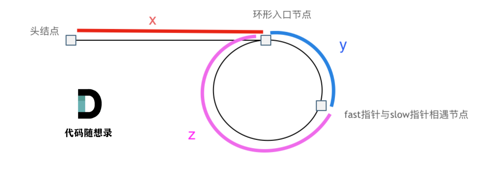
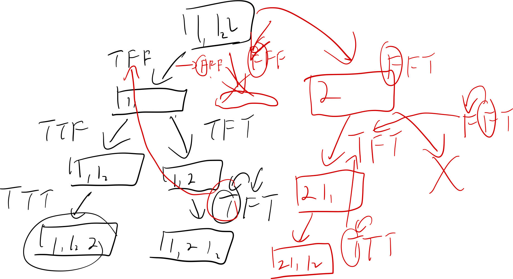
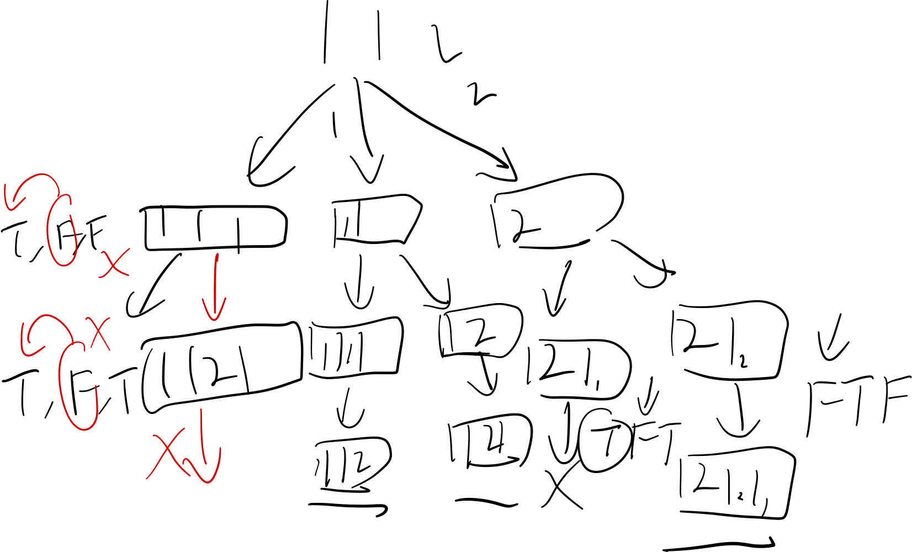
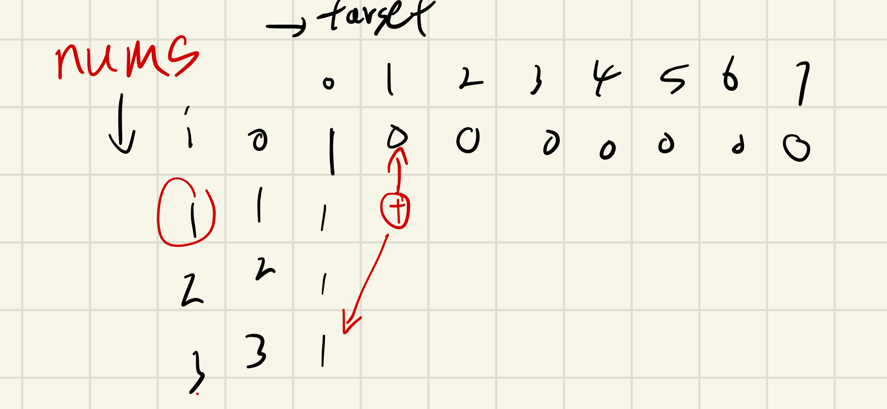

# Leet Code新知识点记录（代码随想录）

## 1. Array

### 1.1 双指针

    一般用于根据数组内连续的前后文对数组进行操作（删除/修改特定元素、维护某项属性等）

#### 1.1.1 Remove elements

problems:

- [[26] Remove Duplicates from Sorted Array](.\26.remove-duplicates-from-sorted-array.cpp)
- [[27] Remove Element](.\27.remove-element.cpp)
- [[283] Move Zeroes](.\283.move-zeroes.cpp)
- [[844] Backspace String Compare](.\844.backspace-string-compare.cpp)

#### 1.1.2 Sliding windows

problems:

- [209] Minimum Size Subarray Sum
- [904] Fruit Into Baskets
- [[76] Minimum Window Substring](.\76.minimum-window-substring.cpp) __(Hard)__

### 1.2 Flow control

    数组功底，如矩阵螺旋等复杂循环。

problems:

- [[54] Spiral Matrix](.\54.spiral-matrix.cpp)
- [[59] Spiral Matrix II](.\59.spiral-matrix-ii.cpp)

## 2. Linked List

可以增设虚拟空头节点，方便遍历

- [203] Remove Linked List Elements
- [707] Design Linked List
- [206] Reverse Linked List
- [24] Swap Nodes in Pairs
- [19] Remove Nth Node From End of List

### 2.1 Complicated Problem: Linked List Cycle II

- [[142] Linked List Cycle II](.\142.linked-list-cycle-ii.cpp)

O(1) space: 数学推导问题，设环状链表前一共有 $x$ 个节点（不包括入口节点），
环状列表一共有 $d$ 个节点，快慢指针 (速度 $2:1$ ) 第一次相遇时，入口点到相遇点间隔$y$个节点（不包括相遇点） ，环形列表剩余 $z$ 个节点



则可知:

$$
2(x+y) = x+y+n(y+z)
$$

$$
=> x = (n-1)(y+z) + z
$$

即：

$$
x=z+(n-1)*d
$$

因此，找到第一次相遇点后，设置**两个速度相同的节点分别从相遇点和头结点出发，下一次相遇的节点必定为入口节点**（速度相同时，环外节点行走$x$个长度，环内行走$x=z+(n-1)d$个长度，两点必定于入口节点相遇）

## 3. HashMap

### 3.1 数之和(定长组合)

- [1] Two Sum
- [454] 4Sum II 多个数组，等分成两组（O(n^2)），用map记录其中一半的组合
- [[15] 3Sum](.\15.3-sum.cpp) 需要返回对应的数值而非idx，且需要去重，所以使用双指针更优（map需要频繁插入删除，耗费较高）
- [[18] 4Sum](.\18.4-sum.cpp) 原理同3Sum，不同点在于剪枝条件

## 4. 字符串

针对字符串处理，关键方法：双指针、哈希、dp、kmp

### 4.1 字符串编辑

涉及翻转操作时，所有需要调换子串位置而不改变子串内部顺序的情况，都可通过**整体翻转+翻转子串**实现，务必牢记

- [[344] Reverse String](.\344.reverse-string.cpp)
- [[541] Reverse String II](.\541.reverse-string-ii.cpp)
- [[151] Reverse Words in a String](.\151.reverse-words-in-a-string.cpp) **O(1) 空间复杂度：双指针移除多余空格，再整体翻转，最后翻转每个单词**
- [KamaCoder_55.右旋字符串](.\KamaCoder_55.右旋字符串.cpp) 整体翻转 + 翻转子串

### 4.2 字符串匹配 (KMP)

- [[28] Find the Index of the First Occurrence in a String](.\28.find-the-index-of-the-first-occurrence-in-a-string.cpp) **KMP**算法应用（算法导论3rd, P588），通过匹配pattern的**最长相同的真-前-后缀**（$P_i$）构建$next[i]$: 到i为止的$P_i$的长度（或长度-1，即前缀末尾idx），匹配失败时通过检查$next$获知：本次匹配的后缀($P_q$)已经相当于匹配完毕了下次匹配的多少个前缀，进而回退pattern的匹配指针，继续下一次匹配
- [[459] Repeated Substring Pattern](.\459.repeated-substring-pattern.cpp)kmp法：构建next后，通过检测s.len%(s.len - (next[n-1] + 1) ) == 0判断是否为周期串，正确性证明简述：充分性：如果一个串为由最小原子串$x^n$组成的周期串，则其最长公共前后缀 ($P_q$) 一定为$x^{n-1}$,因此其不包含的子串即为最小周期串x；必要性：如果s.len%(s.len - (next[n-1] + 1) ) == 0，则其$P_q$不包含的子串${s[n - x: n - 1]}$可与：后缀末尾、前缀末尾、原字符串的substring ${s[n - 2*x:n - x - 1]}$完全相等，至此初始态已证明，根据数学归纳法，可延伸至全部字符串，因此可推出s必定为周期串。

## 5. 栈与队列

- [232] Implement Queue using Stacks 栈实现队列，pop前检查pop栈是否有剩余
- [225] Implement Stack using Queues 队列实现栈，非空队列为入栈队列，模拟出栈时将除最后一个元素外的所有元素转移至另一队列，然后弹出最后一个元素；可优化至单队列模拟：循环模拟出栈时循环进出队列size-1次，此时队列头为栈顶元素。

### 5.1 字符匹配

- [[20] Valid Parentheses](.\20.valid-parentheses.cpp)
- [[1047] Remove All Adjacent Duplicates In String](.\1047.remove-all-adjacent-duplicates-in-string.cpp)
- [[150] Evaluate Reverse Polish Notation](.\150.evaluate-reverse-polish-notation.cpp)

### 5.2 元素计数TopK - 单调队列、优先队列（最大/小堆）

除单调栈外，还有单调队列，一般用于维护某个区间内的候选值（最大/最小值），优先队列可用于统计前k个最大/最小元素

- [[239] Sliding Window Maximum](.\239.sliding-window-maximum.cpp) 单减队列-维护窗口内可能的最大值，省去存储所有元素
- [[347] Top K Frequent Elements](.\347.top-k-frequent-elements.cpp) map计数，维护大小为k的最小堆，遍历完成后堆内即为最多的k个元素，注意条件判断

## 6. 二叉树

先、中、后序遍历均可转为使用标记的迭代法，即在待访问节点上压入nullptr做标记，遇到后访问。

- [[144] Binary Tree Preorder Traversal](.\144.binary-tree-preorder-traversal.cpp)
- [[94] Binary Tree Inorder Traversal](.\94.binary-tree-inorder-traversal.cpp)
- [[145] Binary Tree Postorder Traversal](.\145.binary-tree-postorder-traversal.cpp)
- [[2476] Closest Nodes Queries in a Binary Search Tree](.\2476.closest-nodes-queries-in-a-binary-search-tree.cpp) 陷阱：题目未明确数组是平衡树，最坏情况变为线性搜索，所以先中序遍历记录为数组，保证每次都以$O(logN)$完成查询，复杂度$O(n + qlogn)$

## 7. Backtracking

基本的dfs都涉及了隐式的回溯，一般出现于无更优解，如遍历某个集合的所有子集才能求解的复杂问题中 (NP hard)。一般可通过特定条件打断遍历进行剪枝，但无法根本性改变其复杂度。

### 7.1 组合（子集）

- [[77] Combinations](.\77.combinations.cpp) 标准回溯模板，基本问题：求组合问题，复杂度$O((^n_k)*k)$
- [[216] Combination Sum III](.\216.combination-sum-iii.cpp) 在子集上追加限制，因此剪枝可从两方面考虑：额外限制（当前sum是否超过n）、子集数量（同上题）
- [[17] Letter Combinations of a Phone Number](.\17.letter-combinations-of-a-phone-number.cpp) 不同集合间的组合问题，递归栈的深度代表所有集合的顺序，函数内的遍历代表各个集合内元素的选取（N皇后雏形）
- [[39] Combination Sum](.\39.combination-sum.cpp) 可重复选取问题，即递归的idx每次不增加1
- [[40] Combination Sum II](.\40.combination-sum-ii.cpp) 元素有重复，但每个元素只能选取一次，可使用排序+指针去重法，算法思路：findComb(idx, target)中，假设已经选取了$n (n>=0)$个$x(x = candidate[idx - 1]) $, 那么放入candidate[idx]，递归遍历所有包含$n+1$个$x$的子集的解，遍历完毕后，如果$ candidate[idx+1] == candidate[idx]$，则跳过，免去再次求$n+1$个$x$的子集的解，完成去重
- [[131] Palindrome Partitioning](.\131.palindrome-partitioning.cpp) 求所有回文子串的分割，依然需要遍历所有分割方案，通过判断子串是否是回文串来进行剪枝，而回文子串可通过DP求解:

```dp[i][j]
  dp[i][j] = s[i] == s[j] && dp[i + 1][j - 1]
```

- [[93] Restore IP Addresses](.\93.restore-ip-addresses.cpp) 复原ip地址，注意终止条件的判断，segment到达4即可返回，而是否合法ip需要额外判断，且在遍历分割情况时不需要i限制于0-3之间，因为大于255时将自动返回
- [[78] Subsets](.\78.subsets.cpp) 记录所有子集，即每次进入内部节点时都记录答案
- [[90] Subsets II](.\90.subsets-ii.cpp) 含有重复元素的子集，排序后指针去重
- [[491] Non-decreasing Subsequences](.\491.non-decreasing-subsequences.cpp) 数组不可排列，含重复元素的子集，需要在回溯时每一层添加一个check检查是否有重复元素，或使用dfs在上一被选元素和当前元素相同时，跳过“选择上一元素而不选当前元素”的分支，保留“都选”“都不选”“不选上一个而选下一个”，完成去重

### 7.2 排列

$O(n!)$复杂度，深度为组合中的位置，每层遍历所有数组放在该位置上，跳过已放好的元素

- [[46] Permutations](.\46.permutations.cpp)
- [[47] Permutations II](.\47.permutations-ii.cpp) 带重复元素的排列，不可包含相同排列
  - 方法一：局部check去重+全局check维护未排列元素；
  - 方法二：排序＋全局check，此时全局check既用于维护排列元素，又用于去重，且有两种思路：

    ````C++
     if(same_with_prev and totalCheck[i - 1] == false) continue;
    ````

    此时，程序可识别dfs树中是否已经遍历过了“使用了上一个相同元素，放置于同一位置p[depth]”的排列，如果是则跳过，此时可跳过当前节点的所有其他子节点，也就是同层之间去重，效率较高

    

    或者可理解为，控制相同元素$x_b$必须在其上一个相同元素$x_a$之后被放置

    ````C++
     if(same_with_prev and totalCheck[i - 1] == true) continue;
    ````

    此时，程序可识别dfs树是否处于：正在遍历”使用了上一个相同元素在已排列的某一位置“的节点当中，如果是则跳过，此时程序跳过的是任意两同元素按原前后顺序排列的叶节点，也就是只保留相同元素在所有排列中倒序排列的情况，由于是在同一分支内（纵向）去重，涉及许多无用搜索，比思路1更加浪费时间

    

### 7.3 Erulerian Path/Cycle

- [[332] Reconstruct Itinerary](.\332.reconstruct-itinerary.cpp) 求欧拉路径，用回溯算法也可解开，但注意回溯时图要记录为加权图，即以int记录同种票的个数，否则会超时
- [753] [Cracking the Safe](https://leetcode.cn/problems/cracking-the-safe/) 相似题目(未解答)

#### 欧拉回路/路径

参照本科ppt离散数学（上）chpt2.4, 欧拉回路/路径，即在连通图中能够经过其所有边恰好一次的一个环/路径，欧拉图是存在欧拉环的图，半欧拉图是没有欧拉环，但存在欧拉路径的多重图。

一个有向图是欧拉图的**充要**条件为：该图为弱连通图，且该图所有节点的出度都等于其入度。

一个有向图是半欧拉图的**充要**条件为：该图为弱连通图，且该图所有$n-2$个节点的出度都等于其入度，且另外两个点中，其中一个点的入度比出度大1，另一个节点的入度比出度小1。

##### Hierholzer算法

搜索欧拉回路：

- 从任意起点出发
- 进行dfs，每次删除访问过的边
- 当前节点无可访问的边时，将当前节点入栈
- dfs结束后，将结果倒序，即为欧拉回路

在建立欧拉路径时，需要指定起点（即出度比入度大1的点），然后同上进行搜索即可。算法思路：在dfs中，每遇到一个边就将其删除，那么该算法可看为每次都会成对地删除一个边的入度和出度，而由于遍历会访问所有可到达的边，且其终点一定是最后那个只剩下一个入度的节点，因此该算法访问边的倒序即该图的欧拉路径

### 7.4 hard题目

- [[51] N-Queens](.\51.n-queens.cpp) 在《挑战程序设计》中已有解答，主要难点在如何构造棋盘和判断攻击范围，不再赘述
- [[37] Sudoku Solver](.\37.sudoku-solver.cpp) 思路和N皇后基本无异，但N皇后每一行只有一格能放置棋子，而数独则需要在每一格都填入一个数字，因此可以在N皇后基础上拓展成“二维”回溯（实际上它并不是二维的，只出于方便理解，将行列都作为递归参数）

## 8 Greedy Algorithms

如果可以通过每次都选择一个局部的最优解来求得全局最优解时，贪心算法可以成立，如：无负权值的图下的dijkstra

- [[455] Assign Cookies](.\455.assign-cookies.cpp) 将两数组排序，后有两种思路：

  1. 从最大的小孩开始遍历，如果当前最大的饼干无法满足当前需求最大的小孩，则说明该需求不可能被满足，所以略过当前小孩
  2. 从最小的饼干开始遍历，如果当前饼干无法满足当前最小需求的孩子，则略过当前饼干
- [[376] Wiggle Subsequence](.\376.wiggle-subsequence.cpp)
- [[53] Maximum Subarray](.\53.maximum-subarray.cpp) DP思路：以dp[i]结尾的子数组的和的最大值，当dp[i-1]为负，令dp[i] = nums[i]，遍历数组取得最大值
- [[122] Best Time to Buy and Sell Stock II](.\122.best-time-to-buy-and-sell-stock-ii.cpp)
- [[121] Best Time to Buy and Sell Stock](.\121.best-time-to-buy-and-sell-stock.cpp)
- [[55] Jump Game](.\55.jump-game.cpp)
- [[45] Jump Game II](.\45.jump-game-ii.cpp) 需要记录当前步数和下一步的距离，并在当前步数内找到下一步的最远距离，到达当前步数的结尾时步数＋1，即完成了一步，因为题目明确必定可以到达末尾，因此可将范围缩减至n - 1简化代码
- [[1005] Maximize Sum Of Array After K Negations](.\1005.maximize-sum-of-array-after-k-negations.cpp) O(n + c)原理：利用桶排序思想，计数后从最小值开始遍历
- [[134] Gas Station](.\134.gas-station.cpp) 贪心：从0出发看最远能到达哪里，如果在i处停下，说明i无法到达i+1，即[0-i]区间都不能作为起点，则从i+1开始探查可能的起点
- [[135] Candy](.\135.candy.cpp) **(Hard)** 两种思路：从前向后、从后向前两次遍历；记录递增长度和递减长度一次遍历。具体思路见注释
- [[860] Lemonade Change](.\860.lemonade-change.cpp) 简单硬币贪心，每次尝试用最大的面额找零，保留最小面额
- [[406] Queue Reconstruction by Height](.\406.queue-reconstruction-by-height.cpp)

  多个指标的队列重组，类似题目技巧：按前面降序，后面升序排列，或前面升序，后面降序排列，然后考虑如何重组，本题两种方法：

  - 按身高降序插入：在插入时，**对自己的位置有影响的只有比自己高的人**，因此：按$h$降序、$k$升序排序，从高到低插入$i$时，可以保证$ans$内的所有元素$h_{ans} >= h_i$，且$people$后面的待插入的元素$h_{people} <= h_i$ (相等时，则 $k_{people} > k_i$)，因此后续的人无论插到哪里，对自己的计数规则都没有影响，所以直接插入ans[k]，保证前面大于等于自己的人数即可，为什么按$k$升序见下文对降序的解释，可反推处此升序的逻辑。
  - 按身高升序插入：如果按$h$升序, $k$降序排列，在插入时，因为**已插入的身高对自己没有影响**，所以只关注当前数组的**空位**，保证i前面只能有$k_i$个比自己大的数会插入，就能够确定i的位置，为什么要按k降序？因为假设$h_i == h_j$, $k_i < k_j$，则$i$一定排在$j$的前面，且根据规则这一定会占据$k_j$的一个计数，所以$i$一定会被安排在$j$被插入后，在$j$前的一个“空位”的位置，如果先插入$i$，再根据$k_j$插入了$j$，便多分配了一个空格，产生分配错误
- [[452] Minimum Number of Arrows to Burst Balloons](.\452.minimum-number-of-arrows-to-burst-balloons.cpp)

  区间最多重叠集问题，通过分析可知，射爆气球的最佳位置一定在某个气球的**右端点**，两种思路：

  - 按左端点排序，此时尝试通过不断更新与之重叠的气球之间最近的右端点，尝试射爆更多气球，如果下一个气球左端点超出范围，则需要下一支箭
  - 按右端点排序，最右端的气球必定需要一支箭，因此每次按照当前右端点射爆所有左端点在此之前的气球，遇到下一个无法射爆的气球时，使用下一支箭。这里可能会漏掉一些右端点很远，但箭$i$能射爆的气球，但可证明：如果箭$i$漏掉了这颗气球$b$，则说明在$i$左侧出现了另外的$k$颗必定需要额外$k $颗箭的气球，且在这些箭中的某一支，一定能算入之前被漏掉的气球（因为$b.left < b(i+k).end$）
- [[435] Non-overlapping Intervals](.\435.non-overlapping-intervals.cpp) 经典区间问题，即安排一组区间，保证尽可能多的不重叠的区间被安排，也就等价于删除最少的冲突的区间，按结束时间排序即可，《算法设计》已有证明
- [[763] Partition Labels](.\763.partition-labels.cpp) 与 [[55] Jump Game](.\55.jump-game.cpp)非常相似，但此题是记入重叠区间，看**最小**能覆盖所有互相重叠的区间的范围，不必记入start，也不需要排序，因为字符串本身就已经按start安排好了出现位置，从头遍历即可
- [[56] Merge Intervals](.\56.merge-intervals.cpp) 按左边界排序，然后遇到重叠的区间就直接合并，演示了**lambda函数**的使用方法。

  个人理解：按左边界排序，可以在遍历时最快的找到最近的和自己冲突的区间，而按右边界排序，可以在遍历时最快的找到最近的和自己不冲突的最小区间（[[435] Non-overlapping Intervals](.\435.non-overlapping-intervals.cpp)）
- [[738] Monotone Increasing Digits](.\738.monotone-increasing-digits.cpp) 先找到首个递减的数，再反向下调至前面依然满足递增，但比原数字小（要注意重复的相等的数，因此要找到最后一个绝对递增的数字，然后-1），然后后面所有数置9即可
- [[968] Binary Tree Cameras](.\968.binary-tree-cameras.cpp)

## 9. Dynamic Programming

### 9.1 简单DP

- [[509] Fibonacci Number](.\509.fibonacci-number.cpp)
- [[70] Climbing Stairs](.\70.climbing-stairs.cpp)
- [[746] Min Cost Climbing Stairs](.\746.min-cost-climbing-stairs.cpp)
- [[62] Unique Paths](.\62.unique-paths.cpp)
- [[63] Unique Paths II](.\63.unique-paths-ii.cpp)
- [[343] Integer Break](.\343.integer-break.cpp) 整数拆分，可以将n拆分为$i + (n - i)$, 其中$(n - i)$可以不拆分，也可以再进行拆分（类似重复背包），所以：

  $$
  dp[i] = max_{1 \leq j < n} {max(j * (i - j), j * dp[i - j])}
  $$

### 9.2 Catalan Number

- [[96] Unique Binary Search Trees](.\96.unique-binary-search-trees.cpp) **Catalan Number**问题，对于n个节点的BST，将所有$1 \le i \le n$节点分别作为根节点时，都有互相不同的结构，因此定义：

  - **$G(n)$**: 长度为 $n$的序列能构成的不同二叉搜索树的个数。
  - $F(i,n)$: 以$i$为根、序列长度为$n$的不同二叉搜索树个数 $(1 \leq i \leq n)$。
    可得：

  $$
  G(n) = \sum_{i = 1}^{n}F(i, n)
  $$

  且对于每个以$i$为根的二叉树，其左、右子树分别有$i - 1, n - i$个节点，所以$F(i, n)$为其左右子树结构数$(G)$的笛卡尔积：

  $$
  F(i, n) = G(i - 1) * G(n - i)
  $$

  难度在于如何想到并构造Catalan Number，可以在所有dp相关内容都往这方面考虑一下，尽可能直接地考虑转移方程，如以某个节点作为根，应当想到对于固定节点数的BST而言，其左右子树的节点数量应当是固定的，而结构会有多种情况，在此基础上推出转移方程。相似问题：矩阵链乘法、凸多边形的三角剖分

### 9.3 0-1 Knapsack Problems

- [0-1背包](.\KamaCoder_46.携带研究材料(0-1Knapsack).cpp) 在状态压缩时，要注意每次迭代需要调查原2D数组左上角的数值，因此应每次从前向后遍历避免上一层需要的值被覆盖（从前向后则为重复背包问题的1D压缩）
- [[416] Partition Equal Subset Sum](.\416.partition-equal-subset-sum.cpp)
- [[1049] Last Stone Weight II](.\1049.last-stone-weight-ii.cpp) 深入理解问题的转化：石头两两相撞的过程：a+b转为a-b，扔回堆内，更新重量总和，直到只剩一个石头，可转化为: (a+b)变成(a-b)，再与其他组合进行加减运算，因此最后一个石头的重量可归纳为：$\sum_{i = 0}^n k_i * stones[i] (k_i = 1, -1)$，即将石头分成两组，再统一作差的问题，得到最小值的情况为：尽可能进行二等分，等价于子集目标和(target = sum/2)问题
- [[494] Target Sum](.\494.target-sum.cpp) 转化：问题相当于将部分数字归入负数组，设其累计和为$negs$，然后与剩余组$(sum - negs)$作差得到target有几种选取方法，则有：

  $$
  (sum - negs) - negs = target \rightarrow 2 * negs = sum - target
  $$

  即，问题等价于: 求**非负**目标和$negs$的组合数量，而开始dp前，要注意公式和题目本身的约束，即当$sum-target$为**奇数**或小于0时，没有可用的组合，返回0
- [[474] Ones and Zeroes](.\474.ones-and-zeroes.cpp) 0-1背包扩展至2维空间

**总结：在开始考虑dp前，尽可能通过公式尝试简化问题，转化为如背包、子集目标和等简单的dp问题，不要盲目建立数组，越直接的方法越难设计转移方程，复杂度越大**

### 9.4 Knapsack Problems

完全背包问题在0-1背包基础上，增加了道具可无限选取的条件，因此每次状态转移要从“选择物品i时检查上一行（i-1物品为止，j-weight[i]的重量)”变为”选择物品i时检测本行（i物品为止，j-weight[i]的重量）“判断是否选择当前物品，优化空间时正序遍历。

- [完全背包](.\KamaCoder_52.携带研究材料(KnapsackProblem).cpp)
- [[518] Coin Change II](.\518.coin-change-ii.cpp)
- [[322] Coin Change](.\322.coin-change.cpp)
- [[279] Perfect Squares](.\279.perfect-squares.cpp) dp解法不再赘述，数论解法见 [数论](#数论) 章节

### 9.5 排列数

本节从代码随想录的完全背包问题中独立，认为该类问题和背包问题毫无关联，有自己的解释体系，硬套模板只会走入误区。一般排列的dp[i][j]可解释为：选择前i个元素（num[0:i-1]）分别作为最后一个元素，满足j条件的某个（最优）解

- [[377] Combination Sum IV](.\377.combination-sum-iv.cpp)
  目标和的排列问题：排列问题与普通的组合问题不同，需要提前遍历不同排列为后面的dp提供数据，理解二维dp数组的定义最为重要
  设$n$为$nums$的总数。
  设$dp[i][j]$为：选取了**前i个数**（$nums[0 : i - 1]$）分别作为排列的最后一个元素，且排列之和为$j$的所有排列的总数。
  添加一个辅助函数：设$P[i][j]$为：选取**第i个数**（$nums[i-1]$）作为排列的最后一个元素，且排列之和为$j$的所有排列的总数。显然，P[i][j]所记录的总数之间代表不同末尾的排列，互不重叠，则有：

  $$
  dp[i][j] = \sum_{k = 0}^iP[k][j]
  $$

  提出最后一项：

  $$
  dp[i][j] = \sum_{k = 0}^{i-1}P[k][j] + P[i][j] = dp[i-1][j] + P[i][j]
  $$

  那么，只需要知道$P[i][j]$，就可得到完整的转移方程。
  考虑$P[i][j]$内的所有排列，由于其末尾元素都是$nums[i-1]$，前面的元素没有限制（即$nums$内可选的所有元素），那么我们把这些排列的末尾元素全部移除，就构成了一组新的排列，即：他们的总和为$j-nums[i-1]$，且末尾为$nums$内所有可能的元素（$nums[0 : n - 1]$)，根据dp的定义，我们得到了$P[i][j] = dp[n][j - nums[i - 1]]$，因此，完整的转移方程为：

  $$
  dp[i][j] = dp[i-1][j] + dp[n][j - nums[i - 1]]
  $$

  

  转为一维数组的逻辑不再赘述。
- [KamaCoder_70.爬楼梯（进阶版）](.\KamaCoder_70.爬楼梯（进阶版）.cpp)
- [[139] Word Break](.\139.word-break.cpp) 依然属于排列问题，因为每个单词出现的位置也影响是否能够拼出s，所以需要在内层遍历所有单词，外层遍历s保证检查到每个位置时，所有排列都被考虑到

### 9.6 Knapsack Problem with Limitations

带限制的背包问题，可以提前展开为0-1背包，或在循环内遍历所有可选的个数（选0~k个）

- [KamaCoder_56.携带矿石资源](.\KamaCoder_56.携带矿石资源(Knapsack_Problem_with_Limitations).cpp)

### 9.7 其他问题

- [[198] House Robber](.\198.house-robber.cpp)
- [[213] House Robber II](.\213.house-robber-ii.cpp)
- [[337] House Robber III](.\337.house-robber-iii.cpp)
  树形dp

  官解中的树形DP使用Status储存了“偷或不偷”两种状态，递归要使用两个max来计算notSelect的数值，我们可以继承打家劫舍系列问题的思想，稍微整合一下状态，减少一下比较次数。只需要将Status的两个状态改为

  1. Status.current: 不考虑偷或不偷，到当前节点为止所能取得的最大值
  2. Status.last: 保证不偷当前节点，到该节点为止所能取得的最大值

  考虑实际上这对应了[打家劫舍1](https://leetcode.cn/problems/house-robber/description/)中为下一个状态提供$dp[i-1]$和$dp[i-2]$的两种选择，在递归中以结构体形式储存。

  对于$last$，由于保证了不偷当前节点，所以将到左右子树为止的$current$加起来即可。

  对于$current$，只需要对“保证不偷当前节点能取得的值”（即已经求得的$last$）和“保证不偷左右子树的情况下，偷取当前节点”的值（即$left.last + right.last + r.value$）取最大值即可。

  因此，当前节点转移方程为：

  $$
  r.last = left.current + right.current
  $$

  $$
  r.current = max(last, left.last + right.last + r->val)
  $$

  递归结束后也不必对ans的选或不选进行比较，直接返回current即可。
- [[121] Best Time to Buy and Sell Stock](.\121.best-time-to-buy-and-sell-stock.cpp) 复习dp解法：在第n天定义两个状态：持有股票（1）或不持有股票（0）时手上的钱，每次根据前面的两个状态得到最大利益
- [[122] Best Time to Buy and Sell Stock II](.\122.best-time-to-buy-and-sell-stock-ii.cpp)
- [[123] Best Time to Buy and Sell Stock III](.\123.best-time-to-buy-and-sell-stock-iii.cpp) 考察状态转移：交易两次，全程持股状态变化为：不持股->持股->不持股->持股->不持股, 五种状态, 且相互有关联,所以需要设置5个状态
- [[188] Best Time to Buy and Sell Stock IV](.\188.best-time-to-buy-and-sell-stock-iv.cpp) 进阶：wqs二分
- [[309] Best Time to Buy and Sell Stock with Cooldown](.\309.best-time-to-buy-and-sell-stock-with-cooldown.cpp) 两种思路，添加一种状态，即在第i天结束时进入冷却期
- [[714] Best Time to Buy and Sell Stock with Transaction Fee](.\714.best-time-to-buy-and-sell-stock-with-transaction-fee.cpp)
- [[300] Longest Increasing Subsequence](.\300.longest-increasing-subsequence.cpp)
- [[674] Longest Continuous Increasing Subsequence](.\674.longest-continuous-increasing-subsequence.cpp)
- [[718] Maximum Length of Repeated Subarray](.\718.maximum-length-of-repeated-subarray.cpp) 另类解法：双指针、哈希+二分（没搞懂）
- [[1143] Longest Common Subsequence](.\1143.longest-common-subsequence.cpp) 经典老题
- [[1035] Uncrossed Lines ](.\1035.uncrossed-lines.cpp)与LCS等价
- [[53] Maximum Subarray](.\53.maximum-subarray.cpp)
- [[392] Is Subsequence](.\392.is-subsequence.cpp) 双指针。或借用KMP思想
- [[115] Distinct Subsequences](.\115.distinct-subsequences.cpp)
  $dp[i][j]$: 到$s[i-1]$为止, 子序列$t[0...j - 1]$出现的次数。考虑转移：

  1. 如果s[i-1] != t[j-1], 则其等于到s[i-1]为止的相同子序列个数
  2. 如果s[i-1] == t[j-1], 考虑其子序列的个数，有两种情况
     1. 使s[i-1]作为子序列的最后一个字符，则其数量等于：dp[i-1][j-1]
     2. 使s[i-1]不作为子序列的最后一个字符，则其数量等于：dp[i-1][j]

  因此，转移方程：

  $$
  dp[i][j] = 
  \begin{cases} 
  dp[i-1][j] & s[i-1] \neq t[i-1]\\
  dp[i-1][j-1] + dp[i-1][j] & s[i-1] = t[i-1]
  \end{cases}
  $$
- [[583] Delete Operation for Two Strings](.\583.delete-operation-for-two-strings.cpp) 两种方法

  - 借用LCS：计算最长公共子序列，然后返回m - lcs + n - lcs
  - 设计DP[i][j]：为使word1[0...i-1]和word2[0...j-1]相同，需要删除多少字符？考虑转移：
    1. 如果word1[i-1] == word2[j-1], 则其等于dp[i-1][j-1]
    2. 如果word1[i-1] != word2[j-1], 考虑其最后一步如何得来，有：
       1. 先使word1[0...i-2]与word2[0...j-1]相同，然后删掉word1[i-1]，操作数：dp[i-1][j] + 1
       2. 先使word1[0...i-1]与word2[0...j-2]相同，然后删掉word2[j-1]，操作数：dp[i][j-1] + 1
          两者取最小即可。

  转移方程：

  $$
  dp[i][j] =
  \begin{cases}
  dp[i-1][j-1] & s[i-1] = t[i-1]\\
  min(dp[i-1][j], dp[i][j-1]) + 1 & s[i-1] \neq t[i-1]
  \end{cases}
  $$
- [[72] Edit Distance](.\72.edit-distance.cpp)

  DP[i][j]: 为使word1[0...i-1]与word2[0...j-1]相等，需要最少编辑的距离是多少？

  - 当word1[i-1] == word2[j-1]时，dp[i][j] = dp[i-1][j-1]
  - 当两字符不相等时，有三种选择：

    1. 先保证word1[0...i-1]与word2[0...j-2]相等，此时目标的word2比word1多一个字符word2[j-1]，在word1后插入一个字符(dp[i][j-1] + 1)
    2. 先保证word1[0...i-2]与word2[0...j-1]相等，此时删去word1[i-1](dp[i-1][j] + 1)
    3. 先保证word1[0...i-2]与word2[0...j-2]相等，此时修改word1[i-1]与word2[j-1]相等即可(dp[i-1][j-1] + 1)

  转移方程:

  $$
  dp[i][j] = 
  \begin {cases}
  dp[i-1][j-1] & word1[i-1] = word2[j-1] \\
  min(dp[i][j-1], dp[i-1][j], dp[i-1][j-1]) + 1 & word1[i-1] \neq word2[j-1]
  \end{cases}
  $$
- [[647] Palindromic Substrings](.\647.palindromic-substrings.cpp)
  Manacher算法可在O(n)时间内求出最长的回文子串或所有回文子串的个数，简单解释原理：先在字符串s前后插入#得到新串t，使得t所有回文子串的长度全部变为奇数$(2*x+1)$,然后引入函数f(i): 以t[i]为中心的最长回文串的半径（包括中心），rMax: 最右回文子串的右边界（闭区间，注意这里不一定是最长回文串，维护的是边界最靠右的回文串及其边界），iMax:最右回文子串的中心，然后每次计算新的回文中心时，如果其在最右回文半径内，通过回文串的对称性，找到其关于iMax对称的回文中心j，f(i)初始化为f(j)或rmax到i的距离，取最小值，然后继续向两边拓展
- [[516] Longest Palindromic Subsequence](.\516.longest-palindromic-subsequence.cpp) 求序列，所以不能用manacher

### 9.8 图形问题

可建立2D-dp递推，dp[i][j]一般可表示为：维护[0 : i][0 : j]范围内的某个解

- [[221] Maximal Square](.\221.maximal-square.cpp) 注意初始化，如1xN或Nx1矩阵，或0面积等特殊情况

## 10 单调栈

数据结构的活用

- [[739] Daily Temperatures](.\739.daily-temperatures.cpp)
- [[496] Next Greater Element I](.\496.next-greater-element-i.cpp)
- [[503] Next Greater Element II](.\503.next-greater-element-ii.cpp)
- [[42] Trapping Rain Water](.\42.trapping-rain-water.cpp)
- [[84] Largest Rectangle in Histogram](.\84.largest-rectangle-in-histogram.cpp) 注意：每次都要更新新矩形的左边界，因为其合并后边界会拓宽到更左侧

## 11. 图

图的表示可以根据题目形式变化

### 0. 基础题

- [[841] Keys and Rooms](.\841.keys-and-rooms.cpp)

### 1. 岛屿系列

- [[797] All Paths From Source to Target](.\797.all-paths-from-source-to-target.cpp)
- [[200] Number of Islands](.\200.number-of-islands.cpp)
- [[695] Max Area of Island](.\695.max-area-of-island.cpp) dfs改用循环的模板，需要另开一个next表
- [[1020] Number of Enclaves](.\1020.number-of-enclaves.cpp)
- [[130] Surrounded Regions](.\130.surrounded-regions.cpp) 岛屿问题可以使用并查集，但需要增加一个onEdge判断所属岛屿是否在边缘
- [[417] Pacific Atlantic Water Flow]() 不要犯低级错误，边界条件判断不要用位运算
- [[827] Making A Large Island](.\827.making-a-large-island.cpp) 思路：染色+计算面积，最后合并，找最大合并面积
- [[463] Island Perimeter](.\463.island-perimeter.cpp) 可以直接遍历grid计算，不必按图遍历

### 2. 建表技巧

- [[127] Word Ladder](.\127.word-ladder.cpp)
  - 暴力思路：比对所有字符，相差1的相连，然后bfs搜索
  - 建表优化：对一个n长度的字符串，生成n个对应位置变为通配符的虚拟节点，如：hot->\*ot, h\*t, ho\*. 如果两字符串相连，必定有一个共同的虚拟节点，然后再进行bfs，由于增添了虚拟节点，最终路径长度为dis/2，（节点个数再+1）
  - 枚举优化：wordlist转为set，不对比所有字符，而是枚举字符串能改变的所有可能，再通过查找set确定是否有相连的节点

### 3. 并查集

对于无向图，并查集可以直观地管理相互连通的分支

- [[1971] Find if Path Exists in Graph](.\1971.find-if-path-exists-in-graph.cpp)
- [[684] Redundant Connection](.\684.redundant-connection.cpp)
- [[685] Redundant Connection II](.\685.redundant-connection-ii.cpp)

  并查集无法正确地维护有向图的连通性，因为并查集只能将不同节点归类为无向连通的一个集合。但当有向图唯一地存在一条“非树边”时，也可以使用并查集处理（以下简称UF），因为UF的目的是用来 **检测环边** ，同时还需要引入parent[i]记录每个节点的父节点来 **检测冲突边** （有两个入度的节点），在本题中，UF维护的是“一定能组成树的集合”，但不同集合之间是否能组成树这一点上，该算法是无法检测的，因为当检测到一条冲突边指向了一个**环上节点**时，说明连到冲突节点的那条环边是冗余，而当前这条冲突边不是，但是这被parent提前检测到了，导致两个集合不会合并。举个例子：[[1,4], [1,2], [5,1], [4,5], [2,3], [6,1], [7,6]]，在这里先检测到了一个环1->4->5->1，又检测到了一个冲突边6->1, 5->1，因此如果你拉出一个测试，算法结束后测试uf.same(3,7)，会返回false，但他们本该属于同一棵树。 但本题的特殊性（只有一条冗余边）导致了这种情况只会出现一次，这使并查集使用成为了可能。

  维护两个变量：最后造成冲突的边、最后造成环的边
  当一条边同时造成冲突和环时，优先记为冲突边

  具体步骤：

  1. 当一条边冲突时，优先记录冲突边
  2. 当该边不冲突时，检测是否为环边
  3. 以上不满足，合并两个节点，成为一棵树

  本题的三种情况：

  - 有冲突边，有环边时，去除**冲突边对应的环边，在dfs中为指向非根的后向边。这里被检测的环边不一定是冗余边，因为边的储存是乱序的**
  - 有冲突边，没有环边时，去除最后访问的冲突边，在dfs中为横向边或前向边
  - 没有冲突边，有环边时，去除最后访问的环边，在dfs中为指向根的后向边。

  根据上面的三种情况即可得出如何返回。
- [[1391] Check if There is a Valid Path in a Grid](.\1391.check-if-there-is-a-valid-path-in-a-grid.cpp) 考验建表难度，创情可能题型。

## 12. 模拟、数论

### 12.1 底层模拟

- [[67] Add Binary](.\67.add-binary.cpp)

### 13.2 数论

- [[279] Perfect Squares](.\279.perfect-squares.cpp)

  [四平方和定理](https://baike.baidu.com/item/%E5%9B%9B%E5%B9%B3%E6%96%B9%E5%92%8C%E5%AE%9A%E7%90%86)：任意一个正整数都可以被表示为至多四个正整数的平方和。并且，当且仅当 $n \neq 4^k \times (8m+7)$时，$n$都可以被表示为至多3个正整数的平方和, 否则$n$只能表示为4个正整数的平方和。
  因此，检测方法如下：

  1. 首先检测$n$是否为完全平方数,如果是, 返回1
  2. 其次，当$n = 4^k \times (8m+7)$时，返回4
  3. 否则，检测$n$是否可以被拆分为$a^2 + b^2$, 通过枚举$ 1 \leq a \leq \sqrt{n}$, 检测$n - a^2$是否为完全平方数，若是，则返回2
  4. 以上都不满足,返回3
